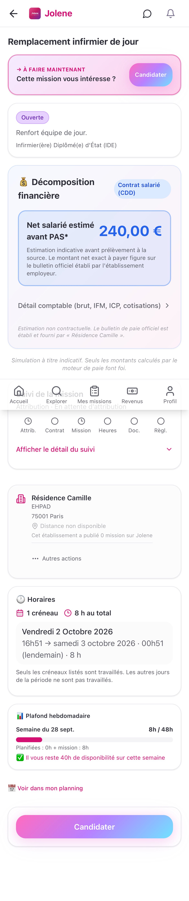
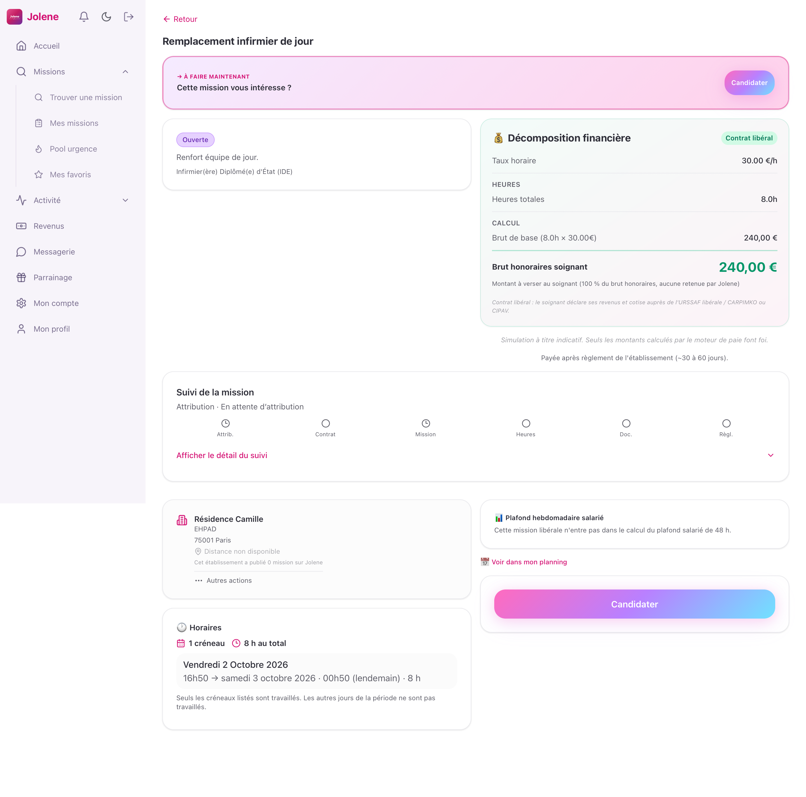
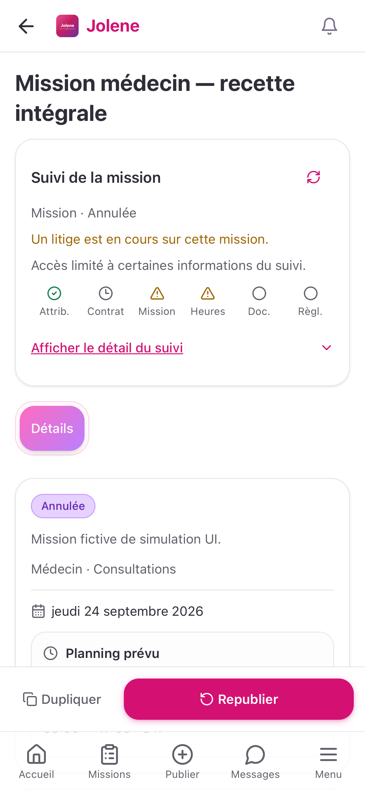

# Suivi commun de mission — 25 septembre 2026

Le détail de mission soignant et le détail établissement présentent désormais le même suivi en six étapes : attribution, contrat Jolene, mission, heures, document financier et règlement. Le titre de la mission reste placé avant ce suivi. Le suivi affiche un résumé compact par défaut ; « Afficher le détail du suivi » déplie les six cartes et leurs raccourcis. Cela regroupe des informations auparavant réparties entre plusieurs écrans ; les documents, présences et finances existants restent leurs espaces de consultation détaillée.

## Correction du volume visuel

La première version affichait systématiquement les six cartes : sur mobile, ce bloc repoussait trop bas le statut, la rémunération et les informations de mission. Le résumé replié expose maintenant un état prioritaire et six repères indépendants, sans pourcentage, nombre d’étapes achevées ni confirmation financière globale. Une annulation ou une étape à vérifier passe avant une étape simplement en cours. Les pannes, litiges et accès limités restent visibles sans ouvrir le panneau ; l’actualisation reste accessible.

Le bouton expose `aria-expanded` et `aria-controls`, garde une cible tactile d’au moins 44 px et permet aussi de refermer le détail. Ouvrir/fermer ne déclenche aucune lecture supplémentaire. Les données canoniques, contrôles d’accès et liens n’ont pas changé. Le suivi reste destiné aux rôles soignant et administrateur d’établissement ; il n’est pas ajouté à l’interface administrateur plateforme.

Hauteurs mesurées dans la recette compilée, en pixels CSS, identiques pour les deux rôles dans ces états :

| Format | Candidature/attribution | Règlement déclaré | Panne de lecture | Litige + accès limité établissement |
|---|---:|---:|---:|---:|
| iPhone 390 × 844 | 184 | 208 | 256 | 264 |
| Android Pixel | 184,84 | 208,84 | 256,84 | 264,84 |
| iPad portrait 820 × 1180 | 197 | 217 | 265 | 273 |
| iPad paysage 1180 × 820 | 197 | 217 | 245 | 273 |
| Ordinateur 1440 × 900 | 197 | 217 | 245 | 273 |

Le scénario initial vérifie que la rémunération soignant et les candidatures établissement sont dans le viewport avec le résumé fermé. Les captures des cinq formats ont été inspectées ; aucun débordement horizontal n’est constaté. Il s’agit de géométrie et de navigation, pas d’une mesure de FPS.

### Rémunération prioritaire : reprise de la régression CI

La recette historique de lisibilité a ensuite révélé que le résumé compact, encore placé avant les blocs de mission, repoussait la rémunération mobile à `y=540,84 px`, au-delà du seuil existant de `422 px` pour un écran de 844 px. La largeur 1440 passait déjà avec le résumé compact. Le montage soignant a été déplacé après les blocs mission/rémunération et avant les informations secondaires ; les bandeaux d’action prioritaire restent en tête. Aucun seuil ni montant n’a été modifié.

La reprise compilée est verte : **30 cas, zéro échec, zéro retry, 123,40 s**. Elle comprend les 20 parcours du suivi sur les cinq formats habituels et 10 cas du test historique de lisibilité (largeurs imposées 390 et 1440, répétées sous les cinq profils navigateur). Chaque cas de lisibilité traverse salariat, honoraires libéraux et rétrocession ; la rémunération doit commencer dans la première moitié de l’écran, son montant reste visible, et le suivi doit venir après son bloc. Les tests du suivi contrôlent cette position initiale avant de faire défiler vers le suivi pour le capturer. Les captures finales mobile et grand écran ont été inspectées.

Résultat machine : `/private/tmp/jolene-lisibilite-compact-final/results.json`, copie permanente `audits/2026-09-25-lancement-national/resultats/lisibilite-et-suivi-30-cas.json`. Cette reprise corrige la position du suivi ; les 30 tests unitaires du composant et de sa synthèse précédemment verts portent sur une logique inchangée.

## Sources et limites de chaque étape

| Étape | Source existante | Confirmation affichée et garde-fou |
|---|---|---|
| Attribution | `missions.soignant_assigne_id`, candidature déjà chargée côté soignant | L’affectation confirme l’attribution. Une candidature enregistrée ne prouve ni acceptation ni refus. Le suivi n’ajoute pas un historique des décisions de candidature. |
| Contrat Jolene | Dernier `contrats_mission`, statut et deux indicateurs de signature | « Deux signatures enregistrées » exige `SIGNE_COMPLET` et les deux signatures vraies. En salariat, ce contrat Jolene ne prouve pas la signature du contrat de travail employeur, qui reste distinct. |
| Mission | `missions.statut` | L’exécution terminée ou annulée est explicite. Une fin de mission ne valide pas les heures. |
| Heures | `presences`, pointages et `valide_par_etablissement` | Les présences consultées doivent toutes avoir arrivée, départ et validation. Un litige actif affiche un état à vérifier. Aucun calcul de paie ou de durée n’est ajouté. |
| Document | `factures_honoraires` pour un régime appliqué `LIBERAL`, `bulletins_paie` pour `SALARIE` | Une facture active émise est distincte d’un avoir, brouillon, document remplacé ou annulé. Un bulletin exige son PDF et un statut `EMIS` ou `PAYE`. Le régime absent reste inconnu, sans repli arbitraire sur le salariat. |
| Règlement | `paiements_soignant`, statut, confirmation du soignant et contestation | `DECLARE` reste « Déclaré, à confirmer ». `RESOLU`, une facture payée ou la mission terminée ne prouvent pas la réception. `CONFIRME` exige aussi `confirme_par_soignant=true`, sans contestation. Le suivi ne calcule pas le solde de la mission. |

Les transferts Stripe, l’escrow et les avances ne sont pas réinterprétés comme une réception bancaire dans cette synthèse. En l’absence de confirmation dans `paiements_soignant`, elle indique « Règlement non confirmé » et propose les finances. Il s’agit d’une limite volontaire de la synthèse, et non d’une affirmation qu’aucun autre mouvement financier n’existe.

Le composant ne crée aucune API, règle financière, mutation ou document. Les liens ouvrent les véritables écrans de contrat, présences, documents ou finances du rôle connecté. Un établissement doit obtenir la permission financière pour la mission concernée avant les lectures financières. Une panne reste indisponible, un refus d’accès reste limité et une collection vide ne devient pas une étape validée.

Les lectures sont limitées à la mission et à quelques colonnes, sans persistance disque. Le composant est remonté à chaque changement de compte, rôle, mission ou établissement. Les requêtes sont annulées au démontage et bornées à dix secondes ; le bouton d’actualisation permet de reprendre une source en échec.

## Vérification fonctionnelle

- **30 tests unitaires verts** : 24 règles de synthèse et 6 tests de composant (réponse obsolète, délai dépassé, permissions d’un autre établissement, changement de compte non assigné, ouverture/fermeture sans relecture, alertes visibles repliées).
- **20 simulations UI vertes du rendu compact** : deux scénarios, deux rôles, cinq formats — WebKit iPad portrait et paysage, WebKit iPhone, Chromium Android et ordinateur. Passe finale de 87,98 s, zéro échec et zéro retry automatique. Les tests ouvrent réellement le détail avant les assertions des six étapes, puis le referment et contrôlent sa hauteur.
- Chaque rôle traverse candidature/attribution, contrat incomplet puis deux signatures, mission terminée avec heures encore non validées, validation, document émis, règlement déclaré puis réception confirmée. Les raccourcis contrat et présences sont réellement cliqués et les écrans de destination contrôlés.
- Second parcours : salariat, bulletin sans PDF puis PDF disponible, erreur HTTP 503 puis actualisation réussie, mission annulée avec litige, règlement contesté. Le rôle établissement limité ne lit aucune des sources financières du suivi et n’obtient pas leur raccourci.
- Les mutations sensibles, signatures, SMS et emails restent absents de ce test de lecture. Les endpoints inattendus échouent ; les accès externes et WebSocket sont bloqués. Les requêtes sont authentifiées par des jetons fictifs et contrôlées sur la mission attendue.
- Compilation de production, typecheck global `tsc -b` et `git diff --check` verts.

Les probes de la première version ont corrigé le banc : utilisation du véritable titre du détail des présences, fermeture par son bouton de l’évaluation post-mission et ajout du contrat explicite `fn_presences_detail_mission` avec un créneau effectif fictif cohérent. Pour le rendu compact, une première tentative a été arrêtée après refus système du port local ; une seconde a révélé une attente manquante du montage SPA dans le helper. Ce helper attend maintenant le vrai bouton avant de lire `aria-expanded`. La passe finale complète utilise cette version ; aucun échec du navigateur n’a été filtré.

Ces simulations valident le rendu et les interactions du frontend sur réponses API contrôlées. Elles ne constituent pas un test RLS SQL, une signature de fournisseur, un virement réel, une preuve de paie, un benchmark de fluidité ou une mesure sur appareil physique.

## Fichiers et preuves

- Produit : `src/components/SuiviMission.tsx`, `src/lib/suiviMission.ts`, intégrations dans `DetailMissionSoignant.tsx` et `DetailMission.tsx`.
- Unités : `src/lib/__tests__/suiviMission.test.ts`, `src/components/__tests__/SuiviMission.test.tsx`.
- Parcours : `e2e/recette-complete-suivi-mission.spec.ts`, contrat strict `e2e/helpers/recette-complete-suivi-mission.ts`.
- Résultat machine initial : `/private/tmp/jolene-suivi-final/results.json`. Résultat du rendu compact : `/private/tmp/jolene-suivi-compact-final/results.json` ; copie permanente `audits/2026-09-25-lancement-national/resultats/suivi-mission-compact-20-cas.json` du projet Jolene.
- Les captures pleine page incluent une barre de navigation fixe à la position du viewport lors de la capture ; elles ne mesurent pas les animations.

