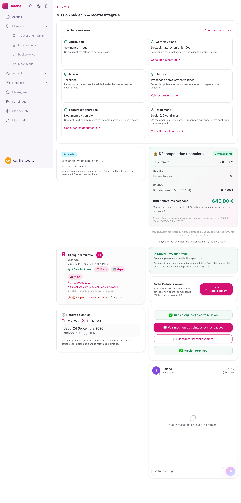
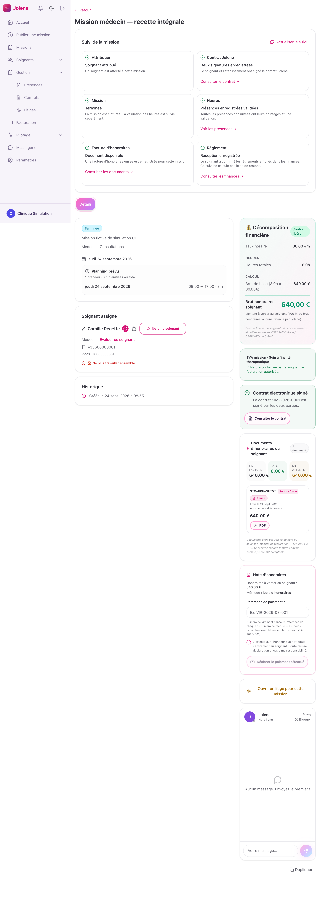
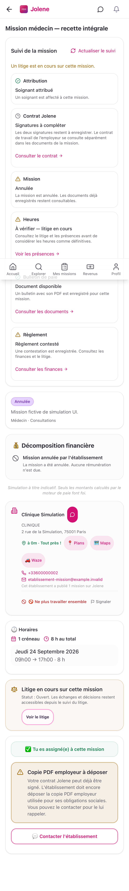

# Suivi commun de mission — 25 septembre 2026

Le détail de mission soignant et le détail établissement présentent désormais le même suivi en six étapes : attribution, contrat Jolene, mission, heures, document financier et règlement. Le titre de la mission reste placé avant ce suivi. Cela regroupe des informations auparavant réparties entre plusieurs écrans ; les documents, présences et finances existants restent leurs espaces de consultation détaillée.

## Sources et limites de chaque étape

| Étape | Source existante | Confirmation affichée et garde-fou |
|---|---|---|
| Attribution | `missions.soignant_assigne_id`, candidature déjà chargée côté soignant | L’affectation confirme l’attribution. Une candidature enregistrée ne prouve ni acceptation ni refus. Le suivi n’ajoute pas un historique des décisions de candidature. |
| Contrat Jolene | Dernier `contrats_mission`, statut et deux indicateurs de signature | « Deux signatures enregistrées » exige `SIGNE_COMPLET` et les deux signatures vraies. En salariat, ce contrat Jolene ne prouve pas la signature du contrat de travail employeur, qui reste distinct. |
| Mission | `missions.statut` | L’exécution terminée ou annulée est explicite. Une fin de mission ne valide pas les heures. |
| Heures | `presences`, pointages et `valide_par_etablissement` | Les présences consultées doivent toutes avoir arrivée, départ et validation. Un litige actif affiche un état à vérifier. Aucun calcul de paie ou de durée n’est ajouté. |
| Document | `factures_honoraires` pour un régime appliqué `LIBERAL`, `bulletins_paie` pour `SALARIE` | Une facture active émise est distincte d’un avoir, brouillon, document remplacé ou annulé. Un bulletin exige son PDF et un statut `EMIS` ou `PAYE`. Le régime absent reste inconnu, sans repli arbitraire sur le salariat. |
| Règlement | `paiements_soignant`, statut, confirmation du soignant et contestation | `DECLARE` reste « Déclaré, à confirmer ». `RESOLU`, une facture payée ou la mission terminée ne prouvent pas la réception. `CONFIRME` exige aussi `confirme_par_soignant=true`, sans contestation. Le suivi ne calcule pas le solde de la mission. |

Les transferts Stripe, l’escrow et les avances ne sont pas réinterprétés comme une réception bancaire dans cette synthèse. En l’absence de confirmation dans `paiements_soignant`, elle indique « Règlement non confirmé » et propose les finances. Il s’agit d’une limite volontaire de la synthèse, et non d’une affirmation qu’aucun autre mouvement financier n’existe.

Le composant ne crée aucune API, règle financière, mutation ou document. Les liens ouvrent les véritables écrans de contrat, présences, documents ou finances du rôle connecté. Un établissement doit obtenir la permission financière pour la mission concernée avant les lectures financières. Une panne reste indisponible, un refus d’accès reste limité et une collection vide ne devient pas une étape validée.

Les lectures sont limitées à la mission et à quelques colonnes, sans persistance disque. Le composant est remonté à chaque changement de compte, rôle, mission ou établissement. Les requêtes sont annulées au démontage et bornées à dix secondes ; le bouton d’actualisation permet de reprendre une source en échec.

## Vérification fonctionnelle

- **28 tests unitaires verts** : 24 règles de synthèse et 4 tests de composant (réponse obsolète, délai dépassé, permissions d’un autre établissement, changement de compte non assigné).
- **20 simulations UI vertes** : deux scénarios, deux rôles, cinq formats — WebKit iPad portrait et paysage, WebKit iPhone, Chromium Android et ordinateur. Une seule exécution finale, zéro retry automatique.
- Chaque rôle traverse candidature/attribution, contrat incomplet puis deux signatures, mission terminée avec heures encore non validées, validation, document émis, règlement déclaré puis réception confirmée. Les raccourcis contrat et présences sont réellement cliqués et les écrans de destination contrôlés.
- Second parcours : salariat, bulletin sans PDF puis PDF disponible, erreur HTTP 503 puis actualisation réussie, mission annulée avec litige, règlement contesté. Le rôle établissement limité ne lit aucune des sources financières du suivi et n’obtient pas leur raccourci.
- Les mutations sensibles, signatures, SMS et emails restent absents de ce test de lecture. Les endpoints inattendus échouent ; les accès externes et WebSocket sont bloqués. Les requêtes sont authentifiées par des jetons fictifs et contrôlées sur la mission attendue.
- Compilation de production, typecheck global `tsc -b` et `git diff --check` verts.

Les deux probes précédant la passe finale ont corrigé le banc : utilisation du véritable titre du détail des présences, fermeture par son bouton de l’évaluation post-mission et ajout du contrat explicite `fn_presences_detail_mission` avec un créneau effectif fictif cohérent. Aucun échec du navigateur n’a été filtré pour obtenir le vert.

Ces simulations valident le rendu et les interactions du frontend sur réponses API contrôlées. Elles ne constituent pas un test RLS SQL, une signature de fournisseur, un virement réel, une preuve de paie, un benchmark de fluidité ou une mesure sur appareil physique.

## Fichiers et preuves

- Produit : `src/components/SuiviMission.tsx`, `src/lib/suiviMission.ts`, intégrations dans `DetailMissionSoignant.tsx` et `DetailMission.tsx`.
- Unités : `src/lib/__tests__/suiviMission.test.ts`, `src/components/__tests__/SuiviMission.test.tsx`.
- Parcours : `e2e/recette-complete-suivi-mission.spec.ts`, contrat strict `e2e/helpers/recette-complete-suivi-mission.ts`.
- Résultat machine local : `/private/tmp/jolene-suivi-final/results.json` ; copie permanente dans `audits/2026-09-25-lancement-national/resultats/suivi-mission-20-cas.json` du projet Jolene.
- Les captures pleine page incluent une barre de navigation fixe à la position du viewport lors de la capture ; elles ne mesurent pas les animations.

